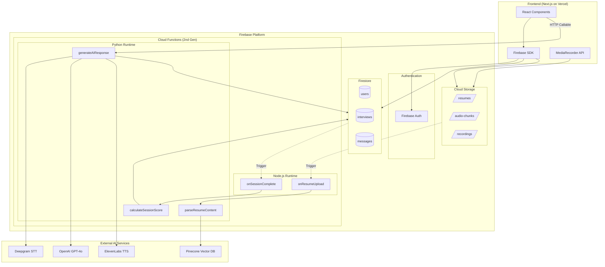
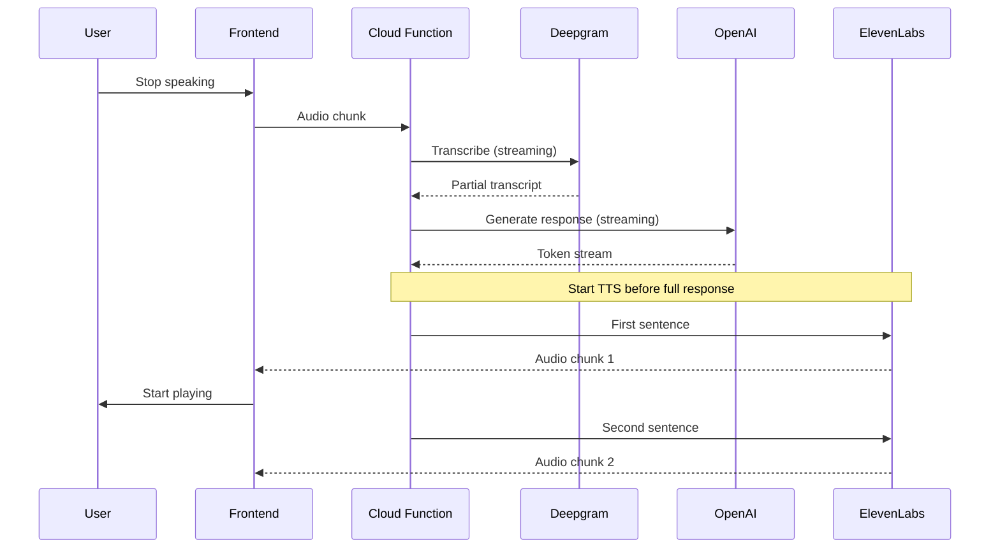

# Firebase Architecture Specification
## AI Interview Coach - Serverless Implementation

---

## 1. Architecture Overview



---

## 2. Technology Stack Summary

| Layer | Technology | Purpose |
|-------|------------|---------|
| **Frontend** | Next.js 14 + React 18 | SSR, component architecture |
| **Styling** | Tailwind CSS + shadcn/ui | Rapid UI development |
| **State** | Zustand + Firebase SDK | Local + real-time state |
| **Auth** | Firebase Authentication | Google, GitHub, Email/Password |
| **Database** | Cloud Firestore | NoSQL, real-time sync |
| **Storage** | Firebase Cloud Storage | Resumes, audio files |
| **Functions** | Cloud Functions (2nd Gen) | Python for AI, Node.js for utilities |
| **Hosting** | Vercel (Frontend) | Edge deployment, SSR |
| **AI - LLM** | OpenAI GPT-4o | Conversation logic |
| **AI - STT** | Deepgram Nova-2 | Speech-to-text |
| **AI - TTS** | ElevenLabs | Text-to-speech |
| **Vector Search** | Pinecone / Firebase Extension | Resume semantic search |

---

## 3. Firestore Data Model (NoSQL Schema)

### Collection Structure

```
firestore-root/
├── users/
│   └── {userId}/
│       ├── [user document]
│       ├── resumes/
│       │   └── {resumeId}/
│       │       └── [resume document]
│       ├── interviews/
│       │   └── {interviewId}/
│       │       ├── [interview document]
│       │       └── messages/
│       │           └── {messageId}/
│       │               └── [message document]
│       └── progress/
│           └── {weekId}/
│               └── [weekly progress document]
├── subscriptions/
│   └── {userId}/
│       └── [subscription document]
└── system/
    └── config/
        └── [app configuration]
```

### Document Schemas

#### users/{userId}
```typescript
interface UserDocument {
  // Identity
  uid: string;                    // Firebase Auth UID
  email: string;
  displayName: string;
  photoURL: string | null;
  
  // Auth providers
  providers: ('google.com' | 'github.com' | 'password')[];
  
  // Profile
  targetRole: string | null;      // "Senior PM", "React Developer"
  difficultyLevel: 'beginner' | 'intermediate' | 'expert';
  preferredPersona: 'friendly' | 'neutral' | 'stern' | 'technical';
  
  // Preferences
  preferences: {
    emailNotifications: boolean;
    autoDeleteRecordings: boolean;
    recordingRetentionDays: number;
  };
  
  // Usage tracking (for free tier limits)
  usage: {
    interviewsThisWeek: number;
    weekStartDate: Timestamp;
  };
  
  // Metadata
  createdAt: Timestamp;
  updatedAt: Timestamp;
  lastLoginAt: Timestamp;
}
```

#### users/{userId}/resumes/{resumeId}
```typescript
interface ResumeDocument {
  id: string;
  fileName: string;
  fileUrl: string;                 // Cloud Storage URL
  fileSize: number;                // bytes
  mimeType: string;
  
  // Parsed content
  status: 'uploading' | 'parsing' | 'ready' | 'error';
  parsedContent: {
    rawText: string;
    skills: string[];
    experience: {
      company: string;
      title: string;
      duration: string;
      highlights: string[];
    }[];
    education: {
      institution: string;
      degree: string;
      year: string;
    }[];
    summary: string;
  } | null;
  
  // Vector embeddings reference (stored in Pinecone)
  vectorId: string | null;
  
  // Metadata
  uploadedAt: Timestamp;
  parsedAt: Timestamp | null;
  isActive: boolean;               // Currently selected resume
}
```

#### users/{userId}/interviews/{interviewId}
```typescript
interface InterviewDocument {
  id: string;
  
  // Configuration
  mode: 'mock' | 'drill';
  targetRole: string;
  difficulty: 'beginner' | 'intermediate' | 'expert';
  aiPersona: 'friendly' | 'neutral' | 'stern' | 'technical';
  focusArea: string | null;        // For drill mode: "system-design", "behavioral"
  
  // Session state
  status: 'lobby' | 'in_progress' | 'completed' | 'cancelled';
  
  // Resume context (denormalized for query efficiency)
  resumeId: string | null;
  resumeContext: {
    skills: string[];
    recentRole: string;
    recentCompany: string;
  } | null;
  
  // Timing
  scheduledAt: Timestamp | null;
  startedAt: Timestamp | null;
  endedAt: Timestamp | null;
  durationSeconds: number | null;
  
  // Recording
  recordingUrl: string | null;
  recordingStatus: 'none' | 'recording' | 'processing' | 'ready';
  
  // Aggregated metrics (calculated post-session)
  metrics: {
    totalQuestions: number;
    totalUserWords: number;
    avgResponseTimeSeconds: number;
  } | null;
  
  // Metadata
  createdAt: Timestamp;
  updatedAt: Timestamp;
}
```

#### users/{userId}/interviews/{interviewId}/messages/{messageId}
```typescript
interface MessageDocument {
  id: string;
  
  // Message content
  role: 'ai' | 'user' | 'system';
  type: 'question' | 'answer' | 'follow_up' | 'intro' | 'closing';
  
  // Content
  text: string;                    // Transcript or AI message
  audioUrl: string | null;         // TTS audio for AI, recorded audio for user
  
  // Timing
  timestamp: Timestamp;
  durationSeconds: number | null;  // Audio duration
  
  // Speech analysis (for user messages)
  speechMetrics: {
    wordsPerMinute: number;
    fillerWordCount: number;
    fillerWords: { word: string; count: number }[];
    pauseCount: number;
    avgPauseDuration: number;
    confidenceScore: number;       // Deepgram confidence
  } | null;
  
  // Question metadata (for AI questions)
  questionMetadata: {
    category: 'behavioral' | 'technical' | 'situational' | 'intro';
    expectedFramework: 'star' | 'general' | null;
    followUpTo: string | null;     // Reference to previous message ID
  } | null;
  
  // Sequence
  sequenceNumber: number;
}
```

#### users/{userId}/interviews/{interviewId} → feedback (embedded or subcollection)
```typescript
interface FeedbackDocument {
  interviewId: string;
  
  // Overall scores (0-100)
  scores: {
    overall: number;
    technicalAccuracy: number;
    communicationClarity: number;
    confidence: number;
    starCompliance: number;
  };
  
  // Detailed analysis
  speechAnalysis: {
    averageWpm: number;
    targetWpm: { min: 120; max: 150 };
    fillerWordsPerMinute: number;
    mostUsedFillers: { word: string; count: number }[];
    improvementTip: string;
  };
  
  contentAnalysis: {
    strengthAreas: string[];
    improvementAreas: string[];
    missedTopics: string[];
  };
  
  // Question-by-question breakdown
  questionFeedback: {
    messageId: string;
    questionText: string;
    answerSummary: string;
    score: number;
    feedback: string;
    improvedAnswer: string | null;
  }[];
  
  // AI-generated summary
  overallSummary: string;
  topThreeImprovements: string[];
  
  // Metadata
  generatedAt: Timestamp;
  modelVersion: string;
}
```

#### subscriptions/{userId}
```typescript
interface SubscriptionDocument {
  userId: string;
  
  // Plan details
  tier: 'free' | 'pro' | 'enterprise';
  status: 'active' | 'canceled' | 'past_due' | 'trialing';
  
  // Stripe integration
  stripeCustomerId: string | null;
  stripeSubscriptionId: string | null;
  stripePriceId: string | null;
  
  // Billing period
  currentPeriodStart: Timestamp | null;
  currentPeriodEnd: Timestamp | null;
  
  // Trial
  trialEnd: Timestamp | null;
  
  // Lifecycle
  canceledAt: Timestamp | null;
  cancelAtPeriodEnd: boolean;
  
  // Metadata
  createdAt: Timestamp;
  updatedAt: Timestamp;
}
```

#### users/{userId}/progress/{weekId}
```typescript
interface WeeklyProgressDocument {
  weekId: string;                  // Format: "2024-W01"
  userId: string;
  
  // Aggregates
  interviewsCompleted: number;
  totalPracticeMinutes: number;
  
  // Score trends
  averageScores: {
    overall: number;
    technical: number;
    communication: number;
    confidence: number;
  };
  
  // Speech improvements
  speechMetrics: {
    avgWpm: number;
    avgFillerWordsPerMinute: number;
  };
  
  // Compared to previous week
  deltas: {
    overall: number;               // +5 means improved by 5 points
    fillerWords: number;           // -2 means reduced by 2 per minute
  };
  
  // Week boundaries
  weekStart: Timestamp;
  weekEnd: Timestamp;
  updatedAt: Timestamp;
}
```

### Indexing Strategy

```javascript
// firestore.indexes.json
{
  "indexes": [
    {
      "collectionGroup": "interviews",
      "queryScope": "COLLECTION",
      "fields": [
        { "fieldPath": "status", "order": "ASCENDING" },
        { "fieldPath": "createdAt", "order": "DESCENDING" }
      ]
    },
    {
      "collectionGroup": "interviews",
      "queryScope": "COLLECTION",
      "fields": [
        { "fieldPath": "mode", "order": "ASCENDING" },
        { "fieldPath": "createdAt", "order": "DESCENDING" }
      ]
    },
    {
      "collectionGroup": "messages",
      "queryScope": "COLLECTION",
      "fields": [
        { "fieldPath": "role", "order": "ASCENDING" },
        { "fieldPath": "sequenceNumber", "order": "ASCENDING" }
      ]
    },
    {
      "collectionGroup": "progress",
      "queryScope": "COLLECTION",
      "fields": [
        { "fieldPath": "weekStart", "order": "DESCENDING" }
      ]
    }
  ]
}
```

---

## 4. Cloud Functions Architecture

### Function Overview

| Function Name | Runtime | Trigger | Purpose |
|---------------|---------|---------|---------|
| `onResumeUpload` | Node.js | Storage (finalize) | Detect new resume uploads |
| `parseResumeContent` | Python | Called by onResumeUpload | Extract text, skills, generate embeddings |
| `generateAIResponse` | Python | HTTP Callable | Real-time interview conversation loop |
| `processAudioChunk` | Python | HTTP Callable | Transcribe user audio via Deepgram |
| `onSessionComplete` | Node.js | Firestore (update) | Trigger scoring when interview ends |
| `calculateSessionScore` | Python | Called by onSessionComplete | Generate comprehensive feedback |
| `updateWeeklyProgress` | Python | Firestore (create) | Update progress metrics |
| `stripeWebhook` | Node.js | HTTP | Handle Stripe subscription events |
| `cleanupOldRecordings` | Node.js | Scheduled (daily) | Delete expired recordings |

### Function Implementations

#### 1. onResumeUpload (Node.js)
```typescript
// functions/src/triggers/onResumeUpload.ts
import { onObjectFinalized } from 'firebase-functions/v2/storage';
import { getFirestore } from 'firebase-admin/firestore';

export const onResumeUpload = onObjectFinalized(
  { 
    bucket: 'interview-coach-resumes',
    memory: '256MiB',
    timeoutSeconds: 60
  },
  async (event) => {
    const filePath = event.data.name;
    // Expected: resumes/{userId}/{resumeId}/{filename}
    const [, userId, resumeId] = filePath.split('/');
    
    if (!userId || !resumeId) return;
    
    const db = getFirestore();
    
    // Update status to parsing
    await db.doc(`users/${userId}/resumes/${resumeId}`).update({
      status: 'parsing',
      fileUrl: `gs://${event.data.bucket}/${filePath}`,
    });
    
    // Call Python function to parse
    // Using PubSub or direct HTTP call
    await callPythonFunction('parseResumeContent', {
      userId,
      resumeId,
      filePath,
      bucket: event.data.bucket
    });
  }
);
```

#### 2. parseResumeContent (Python)
```python
# functions/python/parse_resume.py
import functions_framework
from google.cloud import firestore, storage
from openai import OpenAI
import PyPDF2
import io

db = firestore.Client()
storage_client = storage.Client()
openai_client = OpenAI()

@functions_framework.http
def parse_resume_content(request):
    """Parse resume PDF and extract structured data."""
    data = request.get_json()
    user_id = data['userId']
    resume_id = data['resumeId']
    file_path = data['filePath']
    bucket_name = data['bucket']
    
    try:
        # Download PDF from Storage
        bucket = storage_client.bucket(bucket_name)
        blob = bucket.blob(file_path)
        pdf_bytes = blob.download_as_bytes()
        
        # Extract text
        pdf_reader = PyPDF2.PdfReader(io.BytesIO(pdf_bytes))
        raw_text = "\n".join(page.extract_text() for page in pdf_reader.pages)
        
        # Use GPT-4 to parse structured data
        response = openai_client.chat.completions.create(
            model="gpt-4o",
            messages=[
                {"role": "system", "content": RESUME_PARSER_PROMPT},
                {"role": "user", "content": raw_text}
            ],
            response_format={"type": "json_object"}
        )
        
        parsed_data = json.loads(response.choices[0].message.content)
        
        # Generate embedding for vector search
        embedding_response = openai_client.embeddings.create(
            model="text-embedding-3-small",
            input=raw_text[:8000]  # Truncate for token limit
        )
        embedding = embedding_response.data[0].embedding
        
        # Store in Pinecone (or Firebase Vector Extension)
        vector_id = store_in_pinecone(user_id, resume_id, embedding, parsed_data)
        
        # Update Firestore
        db.document(f'users/{user_id}/resumes/{resume_id}').update({
            'status': 'ready',
            'parsedContent': parsed_data,
            'vectorId': vector_id,
            'parsedAt': firestore.SERVER_TIMESTAMP
        })
        
        return {'success': True, 'resumeId': resume_id}
        
    except Exception as e:
        db.document(f'users/{user_id}/resumes/{resume_id}').update({
            'status': 'error',
            'error': str(e)
        })
        return {'success': False, 'error': str(e)}, 500

RESUME_PARSER_PROMPT = """
Extract the following from this resume in JSON format:
{
  "summary": "2-3 sentence professional summary",
  "skills": ["skill1", "skill2", ...],
  "experience": [
    {
      "company": "Company Name",
      "title": "Job Title",
      "duration": "Jan 2020 - Present",
      "highlights": ["achievement1", "achievement2"]
    }
  ],
  "education": [
    {
      "institution": "University Name",
      "degree": "Degree Name",
      "year": "2020"
    }
  ]
}
"""
```

#### 3. generateAIResponse (Python) - Core Interview Loop
```python
# functions/python/generate_ai_response.py
import functions_framework
from google.cloud import firestore
from openai import OpenAI
import httpx
import base64
import time

db = firestore.Client()
openai_client = OpenAI()

# Keep client warm
DEEPGRAM_CLIENT = None
ELEVENLABS_CLIENT = None

@functions_framework.http
def generate_ai_response(request):
    """
    Main interview loop function.
    Input: { userId, interviewId, audioBase64 (optional), action }
    Actions: 'start', 'respond', 'end'
    """
    start_time = time.time()
    data = request.get_json()
    
    user_id = data['userId']
    interview_id = data['interviewId']
    action = data.get('action', 'respond')
    audio_base64 = data.get('audioBase64')
    
    interview_ref = db.document(f'users/{user_id}/interviews/{interview_id}')
    interview = interview_ref.get().to_dict()
    messages_ref = interview_ref.collection('messages')
    
    if action == 'start':
        return handle_interview_start(interview, interview_ref, messages_ref)
    elif action == 'respond':
        return handle_user_response(
            interview, interview_ref, messages_ref, 
            audio_base64, user_id, interview_id
        )
    elif action == 'end':
        return handle_interview_end(interview_ref)
    
def handle_interview_start(interview, interview_ref, messages_ref):
    """Generate opening question based on persona and role."""
    
    persona_prompts = {
        'friendly': "You are a warm, encouraging interviewer...",
        'neutral': "You are a professional, balanced interviewer...",
        'stern': "You are a demanding, detail-oriented interviewer...",
        'technical': "You are a technical expert who probes deeply..."
    }
    
    system_prompt = f"""
    {persona_prompts[interview['aiPersona']]}
    
    You are interviewing for: {interview['targetRole']}
    Difficulty: {interview['difficulty']}
    
    Candidate context:
    {interview.get('resumeContext', 'No resume provided')}
    
    Start with a brief introduction and your first question.
    """
    
    response = openai_client.chat.completions.create(
        model="gpt-4o",
        messages=[
            {"role": "system", "content": system_prompt},
            {"role": "user", "content": "Begin the interview."}
        ],
        max_tokens=500
    )
    
    ai_text = response.choices[0].message.content
    
    # Generate TTS audio
    audio_url = generate_tts_audio(ai_text, interview['id'])
    
    # Store message
    message_ref = messages_ref.document()
    message_ref.set({
        'id': message_ref.id,
        'role': 'ai',
        'type': 'intro',
        'text': ai_text,
        'audioUrl': audio_url,
        'timestamp': firestore.SERVER_TIMESTAMP,
        'sequenceNumber': 0
    })
    
    # Update interview status
    interview_ref.update({
        'status': 'in_progress',
        'startedAt': firestore.SERVER_TIMESTAMP
    })
    
    return {
        'success': True,
        'messageId': message_ref.id,
        'text': ai_text,
        'audioUrl': audio_url
    }

def handle_user_response(interview, interview_ref, messages_ref, audio_base64, user_id, interview_id):
    """Process user audio, generate AI follow-up."""
    
    # 1. Transcribe audio with Deepgram
    transcript, speech_metrics = transcribe_audio(audio_base64)
    
    # 2. Get conversation history
    history = get_conversation_history(messages_ref)
    
    # 3. Store user message
    seq_num = len(history)
    user_msg_ref = messages_ref.document()
    user_msg_ref.set({
        'id': user_msg_ref.id,
        'role': 'user',
        'type': 'answer',
        'text': transcript,
        'speechMetrics': speech_metrics,
        'timestamp': firestore.SERVER_TIMESTAMP,
        'sequenceNumber': seq_num
    })
    
    # 4. Generate AI response
    ai_response = generate_follow_up(interview, history, transcript)
    
    # 5. Generate TTS
    audio_url = generate_tts_audio(ai_response, interview_id)
    
    # 6. Store AI message
    ai_msg_ref = messages_ref.document()
    ai_msg_ref.set({
        'id': ai_msg_ref.id,
        'role': 'ai',
        'type': 'follow_up',
        'text': ai_response,
        'audioUrl': audio_url,
        'timestamp': firestore.SERVER_TIMESTAMP,
        'sequenceNumber': seq_num + 1,
        'questionMetadata': {
            'followUpTo': user_msg_ref.id
        }
    })
    
    return {
        'success': True,
        'userMessageId': user_msg_ref.id,
        'aiMessageId': ai_msg_ref.id,
        'userTranscript': transcript,
        'aiText': ai_response,
        'aiAudioUrl': audio_url,
        'speechMetrics': speech_metrics
    }

def transcribe_audio(audio_base64: str) -> tuple[str, dict]:
    """Transcribe audio using Deepgram."""
    import os
    
    audio_bytes = base64.b64decode(audio_base64)
    
    response = httpx.post(
        "https://api.deepgram.com/v1/listen",
        headers={
            "Authorization": f"Token {os.environ['DEEPGRAM_API_KEY']}",
            "Content-Type": "audio/webm"
        },
        params={
            "model": "nova-2",
            "smart_format": "true",
            "filler_words": "true",
            "diarize": "false"
        },
        content=audio_bytes,
        timeout=30.0
    )
    
    result = response.json()
    transcript = result['results']['channels'][0]['alternatives'][0]['transcript']
    words = result['results']['channels'][0]['alternatives'][0]['words']
    
    # Calculate speech metrics
    duration = words[-1]['end'] if words else 0
    word_count = len([w for w in words if not is_filler(w['word'])])
    filler_words = [w for w in words if is_filler(w['word'])]
    
    speech_metrics = {
        'wordsPerMinute': int(word_count / duration * 60) if duration > 0 else 0,
        'fillerWordCount': len(filler_words),
        'fillerWords': count_fillers(filler_words),
        'confidenceScore': result['results']['channels'][0]['alternatives'][0]['confidence']
    }
    
    return transcript, speech_metrics

def generate_tts_audio(text: str, context_id: str) -> str:
    """Generate TTS audio using ElevenLabs."""
    import os
    from google.cloud import storage
    
    response = httpx.post(
        "https://api.elevenlabs.io/v1/text-to-speech/21m00Tcm4TlvDq8ikWAM",
        headers={
            "xi-api-key": os.environ['ELEVENLABS_API_KEY'],
            "Content-Type": "application/json"
        },
        json={
            "text": text,
            "model_id": "eleven_turbo_v2",
            "voice_settings": {
                "stability": 0.5,
                "similarity_boost": 0.75
            }
        },
        timeout=30.0
    )
    
    # Upload to Cloud Storage
    storage_client = storage.Client()
    bucket = storage_client.bucket('interview-coach-audio')
    blob = bucket.blob(f'tts/{context_id}/{int(time.time())}.mp3')
    blob.upload_from_string(response.content, content_type='audio/mpeg')
    blob.make_public()
    
    return blob.public_url
```

#### 4. calculateSessionScore (Python)
```python
# functions/python/calculate_score.py
import functions_framework
from google.cloud import firestore
from openai import OpenAI

db = firestore.Client()
openai_client = OpenAI()

@functions_framework.http
def calculate_session_score(request):
    """Generate comprehensive feedback after interview completion."""
    data = request.get_json()
    user_id = data['userId']
    interview_id = data['interviewId']
    
    # Get all messages
    messages_ref = db.collection(f'users/{user_id}/interviews/{interview_id}/messages')
    messages = [doc.to_dict() for doc in messages_ref.order_by('sequenceNumber').stream()]
    
    # Build transcript
    transcript = build_transcript(messages)
    
    # Get interview context
    interview = db.document(f'users/{user_id}/interviews/{interview_id}').get().to_dict()
    
    # Calculate speech metrics aggregates
    speech_aggregate = calculate_speech_aggregates(messages)
    
    # Use GPT-4 to generate detailed feedback
    feedback = generate_detailed_feedback(transcript, interview, speech_aggregate)
    
    # Store feedback
    db.document(f'users/{user_id}/interviews/{interview_id}').update({
        'feedback': feedback,
        'metrics': {
            'totalQuestions': len([m for m in messages if m['role'] == 'ai']),
            'totalUserWords': sum(len(m['text'].split()) for m in messages if m['role'] == 'user'),
            'avgResponseTimeSeconds': calculate_avg_response_time(messages)
        }
    })
    
    # Update weekly progress
    update_weekly_progress(user_id, feedback['scores'])
    
    return {'success': True, 'feedback': feedback}

def generate_detailed_feedback(transcript: str, interview: dict, speech_metrics: dict) -> dict:
    """Use GPT-4 to generate structured feedback."""
    
    prompt = f"""
    Analyze this interview transcript and provide detailed feedback.
    
    Role: {interview['targetRole']}
    Difficulty: {interview['difficulty']}
    
    Transcript:
    {transcript}
    
    Speech Metrics:
    - Average WPM: {speech_metrics['avgWpm']}
    - Filler words per minute: {speech_metrics['fillerPerMinute']}
    
    Provide feedback in this JSON structure:
    {{
        "scores": {{
            "overall": 0-100,
            "technicalAccuracy": 0-100,
            "communicationClarity": 0-100,
            "confidence": 0-100,
            "starCompliance": 0-100
        }},
        "speechAnalysis": {{
            "averageWpm": number,
            "improvementTip": "specific advice"
        }},
        "contentAnalysis": {{
            "strengthAreas": ["area1", "area2"],
            "improvementAreas": ["area1", "area2"],
            "missedTopics": ["topic1"]
        }},
        "questionFeedback": [
            {{
                "questionText": "...",
                "answerSummary": "...",
                "score": 0-100,
                "feedback": "...",
                "improvedAnswer": "A stronger answer would be..."
            }}
        ],
        "overallSummary": "2-3 paragraph summary",
        "topThreeImprovements": ["improvement1", "improvement2", "improvement3"]
    }}
    """
    
    response = openai_client.chat.completions.create(
        model="gpt-4o",
        messages=[
            {"role": "system", "content": "You are an expert interview coach providing constructive feedback."},
            {"role": "user", "content": prompt}
        ],
        response_format={"type": "json_object"},
        max_tokens=2000
    )
    
    return json.loads(response.choices[0].message.content)
```

#### 5. onSessionComplete (Node.js Trigger)
```typescript
// functions/src/triggers/onSessionComplete.ts
import { onDocumentUpdated } from 'firebase-functions/v2/firestore';
import { HttpsError } from 'firebase-functions/v2/https';

export const onSessionComplete = onDocumentUpdated(
  {
    document: 'users/{userId}/interviews/{interviewId}',
    memory: '256MiB'
  },
  async (event) => {
    const before = event.data?.before.data();
    const after = event.data?.after.data();
    
    // Only trigger when status changes to 'completed'
    if (before?.status !== 'completed' && after?.status === 'completed') {
      const { userId, interviewId } = event.params;
      
      // Call Python scoring function
      await callPythonFunction('calculateSessionScore', {
        userId,
        interviewId
      });
    }
  }
);
```

#### 6. stripeWebhook (Node.js)
```typescript
// functions/src/webhooks/stripe.ts
import { onRequest } from 'firebase-functions/v2/https';
import Stripe from 'stripe';
import { getFirestore } from 'firebase-admin/firestore';

const stripe = new Stripe(process.env.STRIPE_SECRET_KEY!);
const db = getFirestore();

export const stripeWebhook = onRequest(
  { 
    cors: false,
    memory: '256MiB'
  },
  async (req, res) => {
    const sig = req.headers['stripe-signature']!;
    
    let event: Stripe.Event;
    
    try {
      event = stripe.webhooks.constructEvent(
        req.rawBody,
        sig,
        process.env.STRIPE_WEBHOOK_SECRET!
      );
    } catch (err) {
      res.status(400).send(`Webhook Error: ${err}`);
      return;
    }
    
    switch (event.type) {
      case 'customer.subscription.created':
      case 'customer.subscription.updated':
        await handleSubscriptionChange(event.data.object as Stripe.Subscription);
        break;
      case 'customer.subscription.deleted':
        await handleSubscriptionCanceled(event.data.object as Stripe.Subscription);
        break;
      case 'invoice.payment_failed':
        await handlePaymentFailed(event.data.object as Stripe.Invoice);
        break;
    }
    
    res.json({ received: true });
  }
);

async function handleSubscriptionChange(subscription: Stripe.Subscription) {
  const userId = subscription.metadata.userId;
  
  await db.doc(`subscriptions/${userId}`).set({
    stripeSubscriptionId: subscription.id,
    stripeCustomerId: subscription.customer,
    tier: subscription.items.data[0].price.lookup_key || 'pro',
    status: subscription.status,
    currentPeriodStart: new Date(subscription.current_period_start * 1000),
    currentPeriodEnd: new Date(subscription.current_period_end * 1000),
    cancelAtPeriodEnd: subscription.cancel_at_period_end,
    updatedAt: new Date()
  }, { merge: true });
}
```

---

## 5. Security Rules

### Firestore Security Rules
```javascript
// firestore.rules
rules_version = '2';
service cloud.firestore {
  match /databases/{database}/documents {
    
    // Helper functions
    function isAuthenticated() {
      return request.auth != null;
    }
    
    function isOwner(userId) {
      return request.auth.uid == userId;
    }
    
    function isAdmin() {
      return request.auth.token.admin == true;
    }
    
    function hasValidSubscription() {
      return get(/databases/$(database)/documents/subscriptions/$(request.auth.uid)).data.status == 'active';
    }
    
    // Users collection
    match /users/{userId} {
      allow read: if isAuthenticated() && isOwner(userId);
      allow create: if isAuthenticated() && isOwner(userId);
      allow update: if isAuthenticated() && isOwner(userId);
      allow delete: if isAuthenticated() && isOwner(userId);
      
      // Resumes subcollection
      match /resumes/{resumeId} {
        allow read: if isAuthenticated() && isOwner(userId);
        allow create: if isAuthenticated() && isOwner(userId);
        allow update: if isAuthenticated() && isOwner(userId);
        allow delete: if isAuthenticated() && isOwner(userId);
      }
      
      // Interviews subcollection
      match /interviews/{interviewId} {
        allow read: if isAuthenticated() && isOwner(userId);
        allow create: if isAuthenticated() && isOwner(userId) && canCreateInterview();
        allow update: if isAuthenticated() && isOwner(userId);
        allow delete: if isAuthenticated() && isOwner(userId);
        
        // Messages subcollection (nested under interviews)
        match /messages/{messageId} {
          allow read: if isAuthenticated() && isOwner(userId);
          // Only Cloud Functions should create messages
          allow create: if false;
          allow update: if false;
          allow delete: if false;
        }
      }
      
      // Progress subcollection
      match /progress/{weekId} {
        allow read: if isAuthenticated() && isOwner(userId);
        // Only Cloud Functions should update progress
        allow write: if false;
      }
    }
    
    // Subscriptions collection (top-level for better querying)
    match /subscriptions/{userId} {
      allow read: if isAuthenticated() && isOwner(userId);
      // Only Cloud Functions (via Stripe webhooks) should modify
      allow write: if false;
    }
    
    // System config (admin only)
    match /system/{document=**} {
      allow read: if isAuthenticated();
      allow write: if isAdmin();
    }
    
    // Helper: Check if user can create interview (free tier limit)
    function canCreateInterview() {
      let user = get(/databases/$(database)/documents/users/$(request.auth.uid)).data;
      let sub = get(/databases/$(database)/documents/subscriptions/$(request.auth.uid)).data;
      
      // Pro users have unlimited
      if (sub.tier == 'pro' || sub.tier == 'enterprise') {
        return true;
      }
      
      // Free tier: 1 interview per week
      return user.usage.interviewsThisWeek < 1;
    }
  }
}
```

### Cloud Storage Security Rules
```javascript
// storage.rules
rules_version = '2';
service firebase.storage {
  match /b/{bucket}/o {
    
    // Resume uploads
    match /resumes/{userId}/{resumeId}/{fileName} {
      allow read: if request.auth != null && request.auth.uid == userId;
      allow create: if request.auth != null 
                    && request.auth.uid == userId
                    && request.resource.size < 10 * 1024 * 1024  // 10MB max
                    && request.resource.contentType.matches('application/pdf');
      allow delete: if request.auth != null && request.auth.uid == userId;
    }
    
    // Audio chunks (user recordings during interview)
    match /audio-chunks/{userId}/{interviewId}/{chunkId} {
      allow read: if request.auth != null && request.auth.uid == userId;
      allow create: if request.auth != null 
                    && request.auth.uid == userId
                    && request.resource.size < 50 * 1024 * 1024;  // 50MB max per chunk
      allow delete: if request.auth != null && request.auth.uid == userId;
    }
    
    // TTS audio (generated by Cloud Functions) - public read
    match /tts/{interviewId}/{fileName} {
      allow read: if true;  // Public for playback
      allow write: if false;  // Only Cloud Functions
    }
    
    // Full recordings (post-processing)
    match /recordings/{userId}/{interviewId}/{fileName} {
      allow read: if request.auth != null && request.auth.uid == userId;
      allow write: if false;  // Only Cloud Functions
    }
  }
}
```

---

## 6. Latency Optimization Strategy

### Challenge: Cloud Functions Cold Starts

| Problem | Impact | Solution |
|---------|--------|----------|
| Cold start delay | 1-5 seconds on first request | Min instances warmup |
| Python runtime startup | Slower than Node.js | Pre-warm critical functions |
| Large dependencies | Longer init time | Tree-shake, lazy imports |

### Optimization Techniques

#### 1. Minimum Instances Configuration
```python
# functions/python/main.py
# Deploy with: --min-instances=1

@functions_framework.http
def generate_ai_response(request):
    # This function stays warm with 1 min instance
    pass
```

```yaml
# cloudbuild.yaml
steps:
  - name: 'gcr.io/google.com/cloudsdktool/cloud-sdk'
    args:
      - gcloud
      - functions
      - deploy
      - generateAIResponse
      - --gen2
      - --runtime=python311
      - --trigger-http
      - --min-instances=1      # Keep warm
      - --max-instances=100
      - --memory=1024MB
      - --timeout=60s
      - --region=us-central1
```

#### 2. Connection Pooling & Client Reuse
```python
# Initialize clients OUTSIDE the function handler
# They persist across invocations when instance is warm

from openai import OpenAI
from google.cloud import firestore

# Module-level initialization (reused across requests)
db = firestore.Client()
openai_client = OpenAI()
deepgram_session = httpx.Client(timeout=30.0)
elevenlabs_session = httpx.Client(timeout=30.0)

@functions_framework.http
def generate_ai_response(request):
    # Use pre-initialized clients
    response = openai_client.chat.completions.create(...)
```

#### 3. Streaming Architecture

Instead of waiting for complete responses, stream audio:



#### 4. Firestore Snapshots vs HTTP for Chat UI

| Approach | Latency | Use Case |
|----------|---------|----------|
| **HTTP Response** | Lower for single request | AI response delivery (recommended) |
| **Firestore Snapshot** | Real-time sync | Chat history display, reconnection |

**Recommendation:** Hybrid approach

```typescript
// Frontend: Use HTTP for immediate response, Firestore for sync
const sendMessage = async (audioBlob: Blob) => {
  // 1. Get immediate response via HTTP
  const response = await fetch('/api/interviews/respond', {
    method: 'POST',
    body: audioFormData
  });
  const { aiText, aiAudioUrl } = await response.json();
  
  // 2. Play audio immediately
  playAudio(aiAudioUrl);
  
  // 3. Firestore listener updates transcript history
  // (already set up on component mount)
};

// Firestore listener for persistent history
useEffect(() => {
  const unsubscribe = onSnapshot(
    collection(db, `users/${uid}/interviews/${interviewId}/messages`),
    (snapshot) => {
      setMessages(snapshot.docs.map(doc => doc.data()));
    }
  );
  return unsubscribe;
}, []);
```

#### 5. Regional Deployment

```bash
# Deploy to region closest to users
# US users: us-central1
# EU users: europe-west1

gcloud functions deploy generateAIResponse \
  --gen2 \
  --region=us-central1 \
  --min-instances=1
```

#### 6. Response Caching for Common Patterns

```python
# Cache common opening questions in Firestore
CACHED_OPENINGS = {
    ('pm', 'friendly', 'beginner'): {
        'text': "Hi! I'm excited to learn about your PM experience...",
        'audioUrl': 'https://storage.googleapis.com/cached/pm_friendly_beginner_intro.mp3'
    }
}

def get_cached_or_generate_opening(interview):
    cache_key = (interview['targetRole'], interview['aiPersona'], interview['difficulty'])
    if cache_key in CACHED_OPENINGS:
        return CACHED_OPENINGS[cache_key]
    return generate_new_opening(interview)
```

### Target Latency Budget

| Stage | Target | Optimization |
|-------|--------|--------------|
| Audio upload | <100ms | Chunked upload, compression |
| STT (Deepgram) | <300ms | Streaming transcription |
| LLM (GPT-4o) | <600ms | Streaming, cached context |
| TTS (ElevenLabs) | <300ms | Streaming, turbo model |
| Audio delivery | <100ms | CDN, preloading |
| **Total** | **<1400ms** | Under 1.5s target ✅ |

---

## 7. Implementation Plan

### Phase 1: Foundation (Weeks 1-3)

#### Week 1: Project Setup
| Task | Details |
|------|---------|
| Initialize Next.js project | TypeScript, Tailwind, shadcn/ui |
| Configure Firebase project | Enable Auth, Firestore, Storage, Functions |
| Set up development environment | Firebase emulators, environment variables |
| Create base UI components | Layout, navigation, design system |
| Deploy to Vercel | CI/CD pipeline |

```bash
# Project initialization
npx create-next-app@latest interview-coach --typescript --tailwind --app
cd interview-coach

# Firebase setup
npm install firebase firebase-admin
npx shadcn@latest init

# Cloud Functions setup
firebase init functions
# Select Python and Node.js
```

#### Week 2: Authentication
| Task | Details |
|------|---------|
| Firebase Auth integration | Google, GitHub, Email/Password providers |
| Auth context & hooks | `useAuth()` hook, protected routes |
| User document creation | `onAuthStateChanged` → create user doc |
| Login/Signup UI | Modern, polished forms |
| Session management | Token refresh, logout |

#### Week 3: Storage & Resume Upload
| Task | Details |
|------|---------|
| Cloud Storage integration | Upload component, progress indicator |
| `onResumeUpload` trigger | Detect new files |
| `parseResumeContent` function | PDF extraction, OpenAI parsing |
| Resume display UI | Parsed skills, experience view |
| Storage security rules | User-scoped access |

**Deliverables:**
- ✅ User can sign up/login
- ✅ User can upload resume
- ✅ Resume is parsed and stored
- ✅ User can view parsed resume data

---

### Phase 2: Interview Engine (Weeks 4-6)

#### Week 4: Audio Infrastructure
| Task | Details |
|------|---------|
| MediaRecorder setup | Audio capture component |
| WebRTC audio streaming | Low-latency capture |
| Audio upload to Storage | Chunked upload |
| Deepgram integration | `processAudioChunk` function |
| Live transcription display | Real-time captions |

#### Week 5: AI Conversation Loop
| Task | Details |
|------|---------|
| `generateAIResponse` function | Core interview logic |
| OpenAI integration | Conversation context, follow-ups |
| ElevenLabs TTS | Audio response generation |
| Interview room UI | Chat interface, audio player |
| Real-time message sync | Firestore listeners |

#### Week 6: Session Management
| Task | Details |
|------|---------|
| Interview state machine | lobby → in_progress → completed |
| Session controls | Start, pause, end interview |
| Recording storage | Full session recording |
| Error handling | Graceful degradation |
| Latency optimization | Min instances, caching |

**Deliverables:**
- ✅ User can start interview session
- ✅ AI asks dynamic questions
- ✅ User responses are transcribed in real-time
- ✅ AI generates contextual follow-ups
- ✅ Full conversation is stored

---

### Phase 3: Feedback & Polish (Weeks 7-9)

#### Week 7: Feedback Generation
| Task | Details |
|------|---------|
| `onSessionComplete` trigger | Detect interview completion |
| `calculateSessionScore` function | Comprehensive analysis |
| Speech metrics aggregation | WPM, filler words, pauses |
| Content analysis | STAR compliance, depth |
| Improvement suggestions | AI-generated rewrites |

#### Week 8: Dashboard & Progress
| Task | Details |
|------|---------|
| Feedback dashboard UI | Score visualization |
| Question-by-question breakdown | Detailed feedback view |
| Progress tracking | `updateWeeklyProgress` function |
| Trend charts | Score improvement over time |
| Interview history | List of past sessions |

#### Week 9: Monetization & Polish
| Task | Details |
|------|---------|
| Stripe integration | Checkout, portal, webhooks |
| Free tier enforcement | 1 interview/week limit |
| Upgrade prompts | Paywall UI |
| Error boundaries | Global error handling |
| Performance optimization | Lazy loading, caching |
| Security audit | Review rules, test access |

**Deliverables:**
- ✅ Detailed feedback after each interview
- ✅ Progress tracking dashboard
- ✅ Stripe subscriptions working
- ✅ Free tier limits enforced
- ✅ Production-ready polish

---

### Phase 4: Launch Prep (Week 10)

| Task | Details |
|------|---------|
| End-to-end testing | Full user flow tests |
| Load testing | Concurrent session testing |
| Documentation | User guides, API docs |
| Monitoring setup | Error tracking, metrics |
| Beta testing | Invite early users |
| Production deployment | Final security review |

---

## 8. Cost Estimates (Firebase)

### Monthly Costs at Scale (1,000 MAU)

| Service | Usage | Estimated Cost |
|---------|-------|----------------|
| **Firebase Auth** | 1,000 MAU | Free tier |
| **Firestore** | 500K reads, 100K writes | ~$10-20 |
| **Cloud Storage** | 10GB stored, 5GB transfer | ~$5 |
| **Cloud Functions** | 500K invocations, 1M GB-seconds | ~$50-100 |
| **OpenAI API** | 2M tokens/month | ~$40-80 |
| **Deepgram** | 50 hours transcription | ~$75 |
| **ElevenLabs** | 500K characters | ~$22 |
| **Vercel** | Pro plan | $20 |
| **Total** | | **~$220-320/month** |

### Cost Scaling

| MAU | Estimated Monthly Cost |
|-----|------------------------|
| 100 (Beta) | $50-100 |
| 1,000 | $220-320 |
| 10,000 | $1,500-2,500 |
| 50,000 | $7,000-12,000 |

---

## 9. Next Steps

1. **Immediate**: Create Firebase project and enable services
2. **Day 1**: Initialize Next.js project with Tailwind/shadcn
3. **Day 2-3**: Implement Firebase Auth with Google/Email
4. **Day 4-5**: Build resume upload flow
5. **Week 2**: Begin Cloud Functions development
